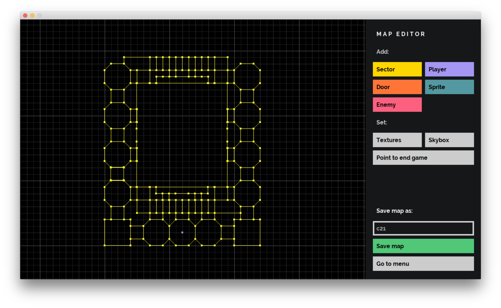

# Doom Nukem like game on C languaje

# Authors

[danjos91](https://github.com/danjos91)

[lokswin](https://github.com/lokswin)

[nasvetil](https://github.com/nasvetil)

[tjuana](https://github.com/tjuana)

This game is a mix of Doom and Duke Nukem 3D physics on C languaje. We implemented some basics functional elements and added new functionality. It was cool and funny.

# Main menu

# How to use

We used Make (Makefile, Mac Os) as a build automation tool.

    $> make -j32
    $> ./doom_nukem (standard pack)
    or
    $> ./doom_nukem [filename]

# Map editor

You can use standard functional for creating game maps.

# Game interface

## Some standard actions

`W / A / S / D` — player movement

`Space` — jump

`⇧ Shift` — squat

`E` — open the door/click on a game action button

Click on the mouse wheel — Fly mode (`Q / E` — fly height modifier)

Click on the left mouse button — shot

`ESC` — exit

=======
DooM-Nukem-3D
#42_school project - Doom-style PortalRendering game.

